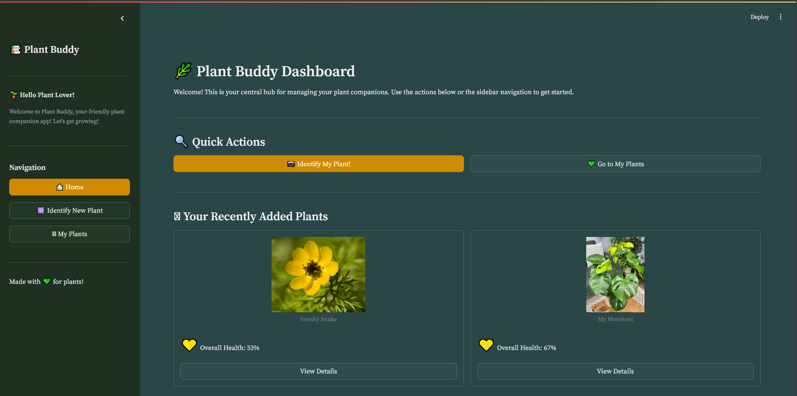

# 🌿 Plant Buddy - Your Green Companion 🌿

[](https://python.org)
[](https://streamlit.io)
[](https://opensource.org/licenses/MIT)
<!-- Add other badges if you have them, e.g., build status, code coverage -->

Welcome to Plant Buddy, your all-in-one application for identifying plants, receiving detailed care instructions, chatting with your leafy friends, and monitoring their health!

**[Link to your deployed app (if applicable)]**

---

## ✨ Features

*   📸 **Plant Identification:** Upload an image of a plant and get instant identification (species, common name, confidence) powered by the PlantNet API.
*   📋 **Detailed Care Guides:** Access comprehensive care instructions for identified plants from our database, covering light, water, temperature, humidity, feeding, and more.
*   💬 **Chat with Your Plants:** Engage in unique, AI-powered conversations with your plants! Each plant can have its own "personality" based on its care profile, thanks to Google Gemini.
*   🪴 **My Plants Collection:** Save identified plants to your personal collection with nicknames, images, and their specific care info and chat logs.
*   📊 **Health Stats & Monitoring:**
    *   Track the overall health score of your saved plants.
    *   View historical health trends with charts.
    *   Visualize key metrics like moisture and temperature with dynamic "Apple Watch-style" rings.
    *   (Optional) Connect to a MongoDB database for live sensor data integration (temperature & moisture).
*   🎨 **Intuitive & Themed UI:** A clean, user-friendly interface built with Streamlit, featuring a custom theme for a pleasant visual experience.
*   📱 **PWA Ready:** Includes a `manifest.json` for Progressive Web App capabilities, allowing users to "install" the app on their devices.

---

## 🖼️ Sneak Peek



---

## 📚 Table of Contents

*   [Features](#-features)
*   [Sneak Peek](#-sneak-peek)
*   [Tech Stack](#-tech-stack)
*   [Prerequisites](#-prerequisites)
*   [Getting Started](#-getting-started)
    *   [Clone the Repository](#1-clone-the-repository)
    *   [Set Up Virtual Environment (Recommended)](#2-set-up-virtual-environment-recommended)
    *   [Install Dependencies](#3-install-dependencies)
    *   [Configure API Keys & MongoDB](#4-configure-api-keys--mongodb)
*   [Running the Application](#-running-the-application)
*   [File Structure](#-file-structure)
*   [How It Works](#-how-it-works)
*   [Contributing](#-contributing)
*   [License](#-license)
*   [Acknowledgements](#-acknowledgements)

---

## 🛠️ Tech Stack

*   **Frontend:** [Streamlit](https://streamlit.io/)
*   **Plant Identification:** [PlantNet API](https://my.plantnet.org/projects/api-doc)
*   **Chat Functionality:** [Google Gemini API (1.5 Flash)](https://ai.google.dev/models/gemini)
*   **Database (Optional Sensor Data):** [MongoDB](https://www.mongodb.com/)
*   **Core Language:** Python 3.9+
*   **Key Python Libraries:**
    *   `requests` (for API calls)
    *   `Pillow (PIL)` (for image processing)
    *   `python-dotenv` (for environment variable management)
    *   `pymongo` (for MongoDB interaction)
    *   `fuzzywuzzy` (for string matching in plant database)
    *   `pandas` (for data handling, e.g., health history charts)

---

## 📋 Prerequisites

Before you begin, ensure you have the following installed:

*   Python (3.9 or higher recommended)
*   pip (Python package installer)
*   Git (for cloning the repository)

---

## 🚀 Getting Started

Follow these steps to get Plant Buddy running on your local machine.

### 1. Clone the Repository

```bash
git clone https://github.com/[YourGitHubUsername]/[YourPlantBuddyRepoName].git
cd [YourPlantBuddyRepoName]
